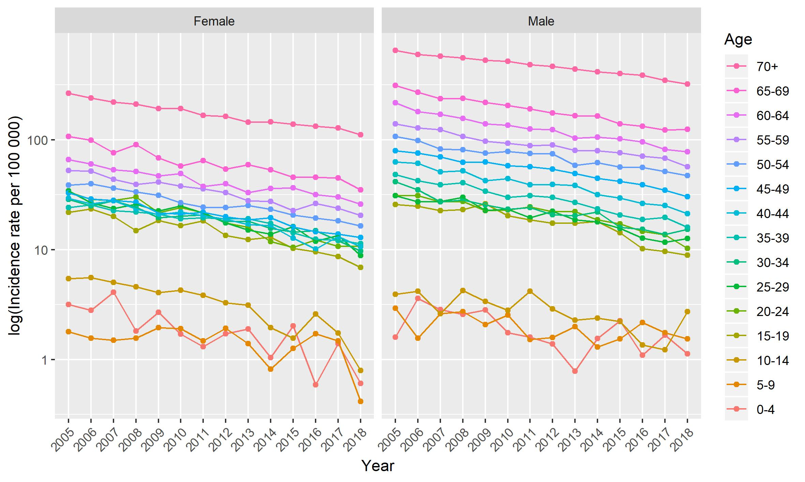
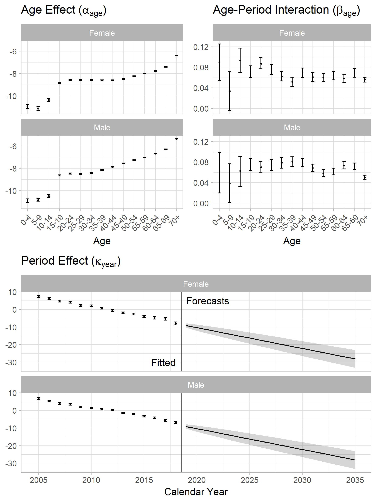
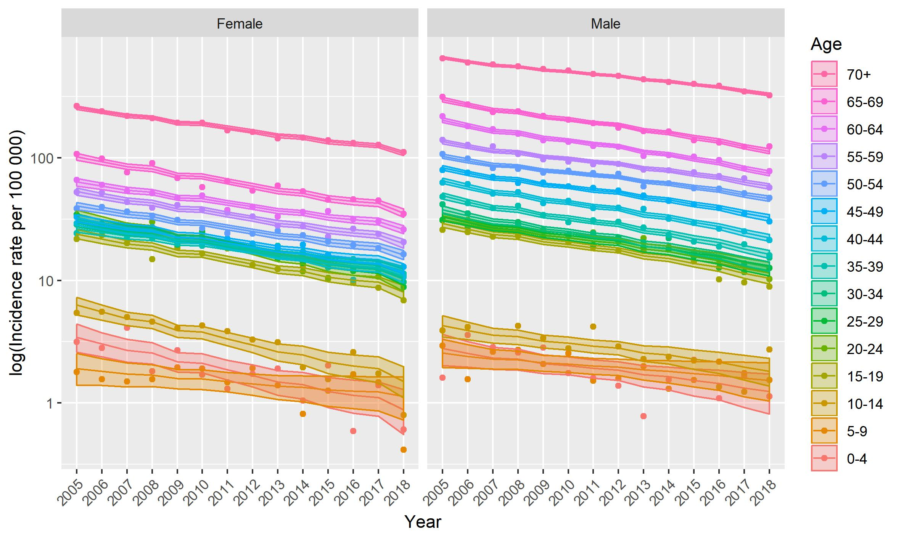
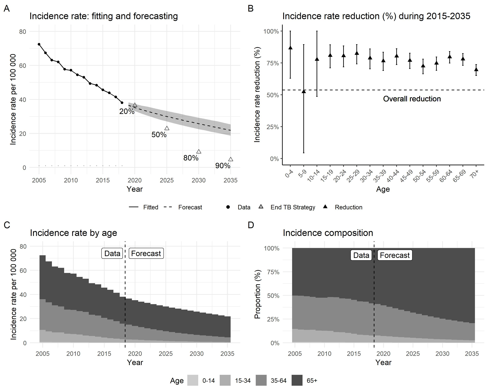
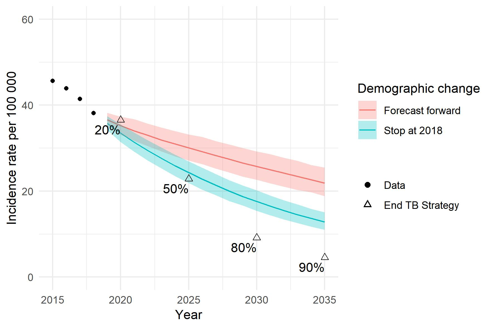

# AgeingTB

A statistical analysis for measuring the impact of population ageing on TB incidence


# Dependency

- demography
- StMoMo
- ggplot2

# Data
All the data used in this repo were rearranged from free-access government data sources
### Incidence data

- Nationwide official data 
- Yearly, from 2005 to 2018
- Notified all-form culture-positive TB cases from the surveillance system

``` R
load("Input/Incidence.rdata")
```

### Population data

``` R
# Population forecasting with 1000 bootstrapping
load("Input/Population_1000.rdata")

# Population forecasting with 10000 bootstrapping
# load("Input/Population_10000.rdata")
```

### Incidence rates
Trends of age-specific incidence rate (log10)


## Model fitting

``` R
n.sim <- length(pop.f$Boot)

set.seed(1166)
models <- estimate(inc.f, inc.m, pop.f, pop.m)
parameters <- extract_parameters(models, n_boot=n.sim)

``` 


Fitted incidence rate (log10)


## Forecasting

``` R
set.seed(1166)

# Forecast future incidence rates
forecasts <- forecast_rates(models, 2050, n.sim, order_f=c(0, 1, 0), order_m=c(0, 1, 0))

# Sample future incidence cases based on rates and population sizes
sims <- simulate_incidence(forecasts, pop.f, pop.m)
```


## Summarising

``` R
# Define age groups
agp <- list(Chd=1:3, Young=4:7, Mid=8:13, Old=14:15)
agl <- c(Chd="0-14", Young="15-34", Mid="35-64", Old="65+")

# Summarise the trends of indices (incidence rate/number, contribution)
summary.age <- summarise_all_age(sims, agp)

# Summarise the age-specific incidence reductions
summary.red.age <- summarise_reduction_age(sims, 2015) 

# Summarise the overall incidence reductions
summary.red.all <- summarise_reduction_all(sims, 2015)
```

## Scenario analysis

``` R
sims.fixed <- simulate_incidence_fix_demo(forecasts, pop.f, pop.m)

summary.age.fixed <- summarise_all_age(sims.fixed, agp)
summary.red.all.fixed <- summarise_reduction_all(sims.fixed, 2015)

```


## Visualisation

## License

See [License: CC-BY-4.0](LICENSE.txt)
